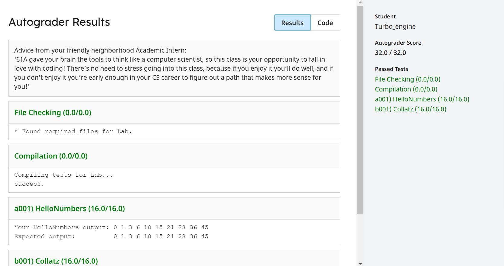
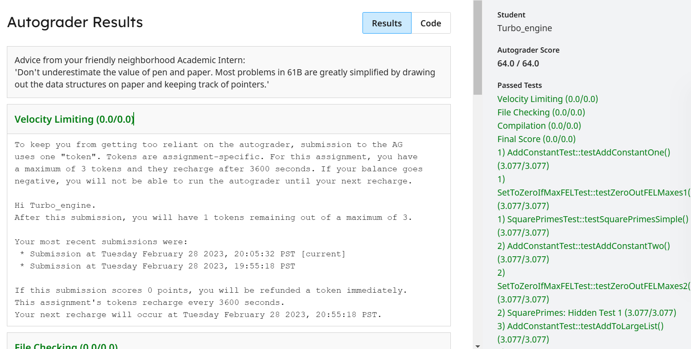

# Data Structures and Algorithm

## Environment Setup
+ [从0开始的CS61b生活 V1 - Google 文档](https://docs.google.com/document/d/1lh1GyJfP4d99Kd2ubFWcHtzMgwW4M3aMDLqafMCGO7I/edit?pli=1#)
+ [Github 生成SSH秘钥（详细教程） - yucreator - 博客园 (cnblogs.com)](https://www.cnblogs.com/yuqiliu/p/12551258.html)
+ [github问题：master和main分支合并 - 知乎 (zhihu.com)](https://zhuanlan.zhihu.com/p/557304573)

#### Guide Page
[Main | CS 61B Sprig 2021 (datastructur.es)](https://sp21.datastructur.es/)

#### ssh
git@github.com:Turbo-engine/CS61B_UC-Berkeley.git

you can copy some useful code
```
git status
git add --all    
git commit -m "intro"  
git push origin main
```

## 0. Useful Tools

1. [Java Visualizer (uwaterloo.ca)](https://cscircles.cemc.uwaterloo.ca//java_visualize/#mode=display)
	[Java debugger - Java Tutor](https://pythontutor.com/java.html#mode=display)
	A website that allows for visual inspection of variables within Java code.
2. 

## 1. Intro, Hello World Java

#### Compile .Java

**hello.java** -> javac[compiler] -> **hello.class** -> java[interpreter] -> xxx

#### **Static Typing**
+ Types are checked before the program is ever run,allow develops  to catch type errors with ease.
+ When we write a program and distribute the compiled version, it (mostly) guaranteed to be free of any type errors. It makes code more reliable.
+ Static variables should pay attention to the modified result after calling in the method. If not, add the "final".

#### HW0
+ relatively simple, can be skipped.
```java
//declare array
int[] numbers = new int[]{9, 2, 15, 2, 22, 10, 6};
```


## 2.Defining and Using Classes
```java
Class Dog{.......}

public class Doglauncher{
	public static main(String[] args){
		Dog small; //Declaration but haven't actually created
		small = Dog(50);//instantiate
		Dog[] dogs = new dog[2];
		
	}
}
```

#### static method

1. Advantages：can be called directly through class name without the need to declear an object.
	For singleton pattern where the constructor is not available externally, variables can be fetched using static methods.
```java
public class MathLibrary {
    public static double squareRoot(double x) {
        return Math.sqrt(x);
    }

    public static double sin(double x) {
        return Math.sin(x);
    }
    //etc..
}
```
2. Disadvantages: static method can't access varibles directly and require an additional variable,which  makes the code difficult to understand.
	Static methods can only access static variables.
```java
public class BankAccount {
    private double balance;

    public void deposit(double amount) {
        balance += amount;
    }
    
    public static void deposit(BankAccount account, double amount) {
        account.balance += amount;
    }
    //etc..
}
```

#### Lab1

+ Basic grammar
```java
/** Buggy implementation of nextNumber! */  
/* fixed the bug */  
public static int nextNumber(int n) {  
    if (n % 2 == 0) {  
        return n / 2;  
    }else{  
        return n * 3 + 1;  
    }  
}
```



## 3.Testing

#### junit
+ JUnit simplifies the process of writing code to test output.
+ Change all test methods to non-static.
+ Use a JUnit runner to run all tests and tabulate results.
```java
import static org.junit.Assert.*;  
import org.junit.Test;  
@Test
class ...{
	org.junit.Assert.assertArrayEquals(expected, input);
}
```

Dog.java
```java
package Dog;  
public class Dog {  
    private int size;  
    public Dog(int s) size = s;
    /** Makes a noise. */  
    public String noise() {  
        if (size < 10)  return "yip";  
        return "bark";  
    }  
}
```
DogTest.java
```java
package Dog;  
import static org.junit.Assert.*;  
import org.junit.Test;  
public class DogTest {      
    @Test  
    public void testSmall() {  
        Dog d = new Dog(3);  
        assertEquals("yip", d.noise());  
    }
    @Test  
    public void testLarge() {  
        Dog d = new Dog(20);  
        assertEquals("bark", d.noise());  
    }  
}
```


## 4.References, Recursion, and Lists
+ Replication of data
	1. Only basic data types and String are deep copies
	2. 8 primitive types in Java: 
		-   byte, short, int, long, float, double, boolean, char
	3. just as with primitive types, the equals sign copies the bits.

#### IntList
-   int first;
-   IntList rest;
```java
public class IntList {
   public int first;
   public IntList rest;
   public IntList(int f, IntList r) {
      first = f;
      rest = r;
   }
   
   /** Return the size of this IntList. */
   public int size() {
      if (rest == null) {
         return 1;
      }
    return 1 + this.rest.size();
   ...
```

Everything else, including arrays, is a reference type.


#### intList
+ This code defines a static method `of` that takes an argList mutable argument list of type `int` and returns an `IntList` object.
+ If the variadic list is not empty, create a new `int` array: `restList`, of length `argList. Length-1`, to store all elements except the first element.
+ Then, use the `System.arraycopy` method to copy the elements in the `argList` array starting with subscript 1 into the `restList` array starting with subscript 0 at `arglist.length-1`.
+ Finally, the method uses `new IntList(argList[0], intlist. of(restList))` to create a new `IntList` object whose first element is the first element of the argList array, The remaining elements are recursively generated by IntList.of(restList).
```java
public IntList(int f, IntList r) {  
    first = f;  
    rest = r;  
}

public static IntList of(int ...argList) {  
    if (argList.length == 0)  
        return null;  
    int[] restList = new int[argList.length - 1];  
    System.arraycopy(argList, 1, restList, 0, argList.length - 1);  
    return new IntList(argList[0], IntList.of(restList));  
}

```


#### Lab2

###### Arithmetic
```java
/*Arithmetic's sum method finish*/
public static int sum(int a, int b) {  
    return a + b;  
}
```

###### DebugExercise
+ part A
```java
public static int divideThenRound(int top, int bottom) {  
    double quotient = (double) top / (double)bottom;  
    return (int)Math.round(quotient);  
}
```
+ part B
```java
public static int max(int a, int b) {  
    return Math.max(a,b);  
}
/** Returns the sum of all elements in x. */  
public static int arraySum(int[] x) {  
    int i = 0;  
    int sum = 0;  
    while (i < x.length) {  
        sum = add(sum, x[i]);  
        i = i + 1;  
    }  
    return sum;  
}
```

+ Part A
```java
/* finish */  
public static void addConstant(IntList lst, int c) {  
    IntList head = lst;  
    while (head != null) {  
        head.first += c;  
        head = head.rest;  
    }  
}
```
+ Part B
```java
/** Returns true if the last digit of x is equal to  
 *  the first digit of x. */
public static boolean firstDigitEqualsLastDigit(int x) {  
    int lastDigit = x % 10;  
    while (x >= 10) {  
        x = x / 10;  
    }  
    int firstDigit = x % 10;  
    return firstDigit == lastDigit;  
}
```
+ Part C
```java
//new JUnit Test
@Test  
public void testSquarePrimesSimple2() {  
    IntList lst = IntList.of(14, 15, 16, 17, 18, 17, 18);  
    boolean changed = IntListExercises.squarePrimes(lst);  
    assertEquals("14 -> 15 -> 16 -> 289 -> 18 -> 289 -> 18", lst.toString());  
    assertTrue(changed);  
}
//code
public static boolean squarePrimes(IntList lst) {  
    // Base Case: we have reached the end of the list  
    if (lst == null) return false;  
    boolean currElemIsPrime = Primes.isPrime(lst.first);  
    if (currElemIsPrime) {  
        lst.first *= lst.first;  
    }  
    return squarePrimes(lst.rest) || currElemIsPrime;  
}
```



#### Project 0


